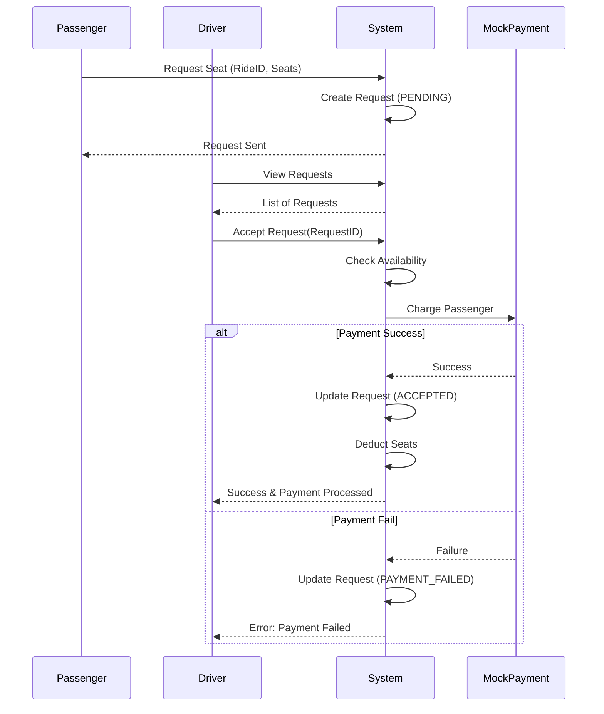

# System Architecture

## Overview

The system is a monolithic repository (Monorepo) containing a Single Page Application (SPA) frontend and a RESTful API backend.

## Layers

### Frontend (Client)
- **Framework**: React with Vite.
- **State Management**: Zustand for global auth state.
- **Routing**: React Router v6.
- **Styling**: TailwindCSS for utility-first, mobile-first design.
- **API Client**: Axios with interceptors for JWT injection.

### Backend (Server)
- **Runtime**: Node.js.
- **Framework**: Express.js.
- **Database**: SQLite (local file `database.sqlite`).
- **Authentication**: JWT (JSON Web Tokens).
- **Validation**: Manual validation in controllers (simplified).

## Data Flow

### Architecture Diagram

```mermaid
graph TD
    Client[Frontend (React)]
    Server[Backend (Express)]
    DB[(SQLite Database)]
    
    Client -- HTTP/JSON --> Server
    Server -- SQL --> DB
    DB -- Result --> Server
    Server -- JSON --> Client
```

1. **User Action**: User interacts with UI (e.g., "Request Seat").
2. **API Call**: Frontend sends HTTP request (POST /rides/:id/requests) with JWT.
3. **Middleware**: Backend `authenticateToken` validates JWT and attaches user to request.
4. **Controller**: `requestController` validates input and interacts with DB.
5. **Database**: SQLite executes SQL query.
6. **Response**: Backend sends JSON response.
7. **State Update**: Frontend updates local state/UI based on response.

## Key Flows

### Pay-on-Accept Flow



1. Passenger requests a seat -> Request created with status `PENDING`.
2. Driver views request -> Clicks "Accept".
3. Backend checks seat availability.
4. Backend triggers Mock Payment.
5. If payment success -> Request status `ACCEPTED`, Seats deducted.
6. If payment fails -> Request status `PAYMENT_FAILED`.

## Directory Structure

- `/frontend`: React application.
- `/backend`: Express application.
  - `/src/controllers`: Request handlers.
  - `/src/routes`: API route definitions.
  - `/src/models`: TypeScript interfaces.
  - `/src/db`: Database connection and schema.
